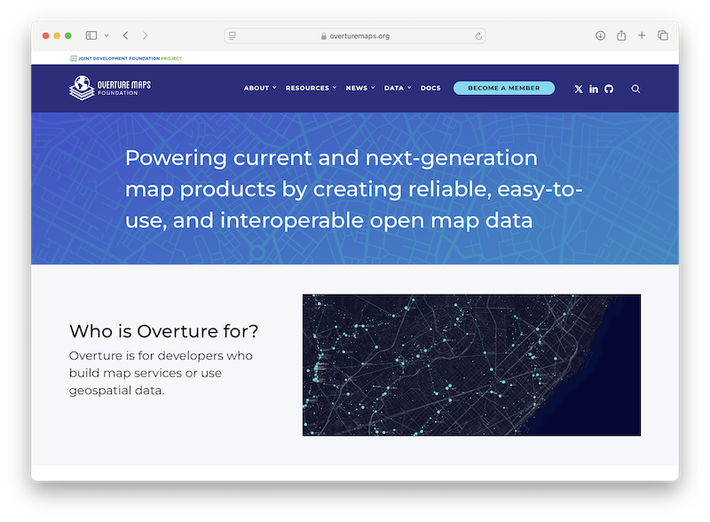
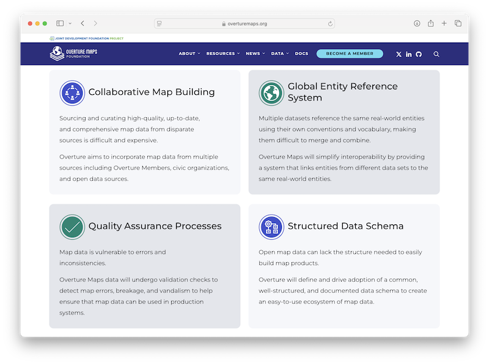

# 1. What is Overture Maps?

| [Home](README.md) | [2. Data Access >>](2-accessing-data.md) |

The [Overture Maps Foundation](//overturemaps.org) is an open data project within the Linux Foundation that aims to "Power current and next-generation map products by creating reliable, easy-to-use, and interoperable open map data."

Primarily, "Overture is for developers who build map services or use geospatial data." Additionally, Overture is a fantastic resource for researchers looking to work with one of the most complete and computationally efficient open geospatial datasets.

## What Overture Provides

## Why open map data? The conflation tax

More geospatial data is available than ever — a proliferation of sensors combined
with connectivity — but integrating it keeps getting more costly and complex.
Overture frames that cost as a **"conflation tax"**: the recurring price of
(re)matching and reconciling datasets every time you want to combine them.

The tax falls in three places:

- **A tax on budgets.** Onboarding data often costs more than licensing it.
- **A tax on market size.** Because conflation is hard, the addressable market for
  any given dataset stays small, and smaller players are disproportionately
  burdened.
- **A tax on intelligence.** Data science and analysis suffer when a hypothesis
  that requires a new dataset can't be quickly tested.

When data is easier to acquire and combine, its value — and the value of every
dataset it can connect to — goes up. Reducing that tax, through a shared open
reference map and stable IDs (see [GERS](4-gers.md)), is the core of what Overture
is for.

---
[Next: Accessing Overture Maps Data >>](2-accessing-data.md)
