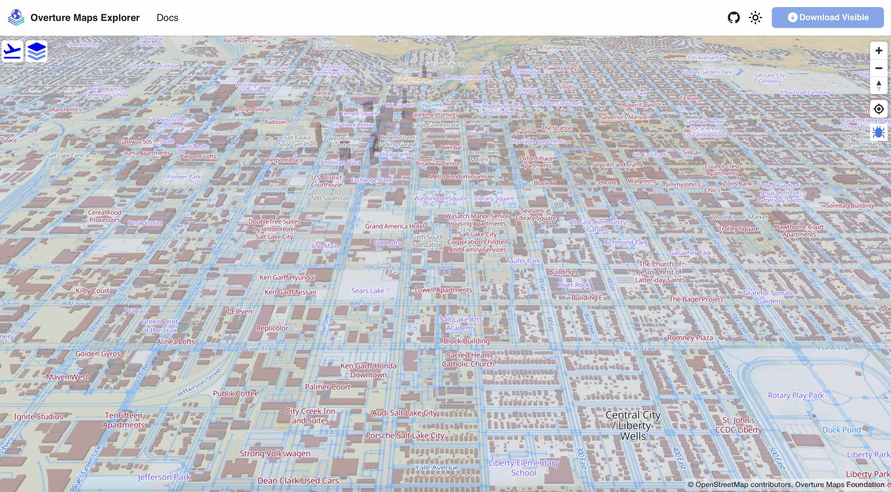

# 2. Exploring & Accessing Overture Maps Data

| [<< 1. What is Overture](1-what-is-overture.md) | [Home](README.md) | [3. GeoParquet & DuckDB >>](3-geoparquet-duckdb.md) |

- [2. Exploring \& Accessing Overture Maps Data](#2-exploring--accessing-overture-maps-data)
  - [1. Overture Maps Explore Page (explore.overturemaps.org)](#1-overture-maps-explore-page-exploreoverturemapsorg)
  - [2. The Official OvertureMaps-Py tool](#2-the-official-overturemaps-py-tool)
  - [3. Where is Overture Data Hosted?](#3-where-is-overture-data-hosted)
  - [4. Visualizing Overture Data with Fused.io](#4-visualizing-overture-data-with-fusedio)

## 1. Overture Maps Explore Page ([explore.overturemaps.org](//explore.overturemaps.org))



Dive directly into Overture data with the Overture Maps Explore Tool.

1. Visit [explore.overturemaps.org](//explore.overturemaps.org) to see an "x-ray" view of all Overture data presented in an interactive map.

    Overture offers **6** data themes:
    - Addresses
    - Base ( Land-use, Infrastructure, Water )
    - Buildings
    - Divisions ( Administrative boundaries / populated places )
    - Places
    - Transportation

   The explore page lets you inspect the properties of each feature and links out to the overture schema: [docs.overturemaps.org/schema](//docs.overturemaps.org/schema) where you can learn more about the attributes available for each theme.

2. The **Download Visible** button will download features in the viewport as one GeoJSON file per theme-type.

    > [!WARNING] Ensure that only the themes you want to download are selected in the themes panel.

The explore page is useful to inspect individual map features and download specific themes in small areas.

## 2. The Official OvertureMaps-Py tool

[OvertureMaps-Py](//github.com/overturemaps/overturemaps-py) is the official command-line tool supported by the Overture Maps Foundation.

1. The easiest way to install the tool is via PyPi using Pip:

    ```bash
    pip install overturemaps
    ```

2. Once installed, you can simply run the tool with any bounding box:

    ```bash
    overturemaps download --type=place \
        --bbox=-79.9390,32.7725,-79.9212,32.7813 \
        -f geojson \
        -o overture_charleston_places.geojson
    ```

    This tool can produce both GeoJSON and parquet output for any Overture theme and type:

    ```bash
    Usage: overturemaps download [OPTIONS]

    Options:
    --bbox BBOX

    -f [geojson|geojsonseq|geoparquet]
                                    [required]
    -o, --output PATH

    -t, --type [address|building|building_part|
                division|division_area| division_boundary|
                place|segment|connector|infrastructure|
                land|land_cover|land_use|water]

                                    [required]

    --help                          Show this message and exit.

    ```

3. For easy visualization, you can drag-n-drop the resulting GeoJSON file into [kepler.gl](//kepler.gl) to see the data on the map.

The [Lonboard example notebook] shows how OvertureMaps-Py can be used as a Python module and seamlessly integrate with powerful visualization tools.

## 3. Where is Overture Data Hosted?

Officially, Overture Maps Data is published in geoparquet format on both AWS and Azure. See more on the [Getting Overture Data](https://docs.overturemaps.org/getting-data/) section of our documentation.

Overture data is also repartitioned and republished by a number of other companies and organizations, such as Wherobots, Carto, Esri, and Fused.io.

<TODO: Screenshot of data mirror page>

For example, Wherobots makes Overture data available in their spatial data catalog so that can be easily accessed from the Wherobots cloud with Apache Sedona.

You can access all of Overture's buildings in Sedona with the following query with Wherobots:

```python
buildings = sedona.sql("SELECT * FROM wherobots_open_data.overture_2025_03_19_1.buildings_building")
```

## 4. Visualizing Overture Data with Fused.io

Fused is a analytical platform with powerful capabilities to read and visualize geoparquet right in your browser. The Fused workbench allows you to run any number of public _[User Defined Functions](https://docs.fused.io/core-concepts/write/) (UDFs)_.

Fused ingests and repartitions Overture data while adding specific metadata for their platform. The resulting files are hosted on source.coop:

```bash
https://data.source.coop/fused/overture/<RELEASE>/
```


1. In a new browser window, navigate to the Fused [Overture Maps Example UDF](https://www.fused.io/workbench/catalog/Overture_Maps_Example-64071fb8-2c96-4015-adb9-596c3bac6787).
2. Click "Add to UDF Builder" in the upper right.
3. In the left-hand panel, you can adjust the **Parameters** to view different Overture data types.
4. Hover over features on the map to see the complete, raw, Overture data. Fused is actually fetching the complete Overture feature and adding it to the map in your browser, not a pre-computed or tiled version of it.
5. If you zoom all the way out, you can see the spatial partitioning of the data. This is a helpful analytical view in itself, showing Overture data density.

    

    _This particular view of Overture data has been re-partitioned by Fused and is hosted on [source.coop](//source.coop)_

---
[Next: GeoParquet & DuckDB >>](3-geoparquet-duckdb.md)
