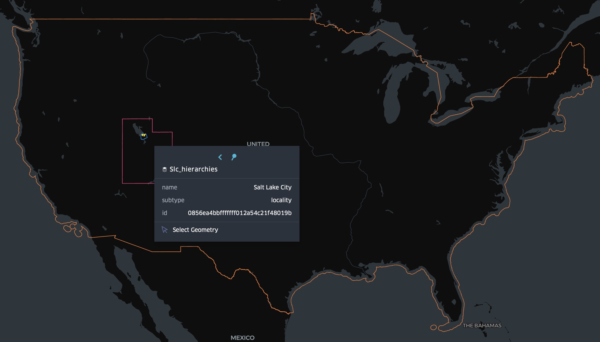

# 4. The Global Entity Reference System (GERS)

| [<< 3. GeoParquet & DuckDB](3-geoparquet-duckdb.md) | [Home](README.md) | [5. Base Theme >>](5-base-theme.md) |

- [4. The Global Entity Reference System (GERS)](#4-the-global-entity-reference-system-gers)
  - [1. Exploring Overture's Divisions and Hierarchies with GERS](#1-exploring-overtures-divisions-and-hierarchies-with-gers)
  - [2. Data Changelog](#2-data-changelog)
    - [1. Identify new places in Salt Lake City](#1-identify-new-places-in-salt-lake-city)
  - [3. Bridge Files](#3-bridge-files)
  - [4. GERS Onboarding Services](#4-gers-onboarding-services)
    - [1. "Gersifying" buildings in Fused.io](#1-gersifying-buildings-in-fusedio)
    - [2. Adding GERS IDs to places with Wherobots](#2-adding-gers-ids-to-places-with-wherobots)

A GERS ID is a 128-bit unique identifier that Overture keeps stable across data releases and updates. For themes like Buildings, Divisions, Places, and Transportation, Overture performs feature-level conflation to preserve ID stability.

Themes that do not conflate multiple input sources use deterministic hashes to ensure consistent matching from input datasets, such as OpenStreetMap, to an 128-bit ID that is fully compatible with the larger GERS ecosystem.

## 1. Exploring Overture's Divisions and Hierarchies with GERS

Overture's _Divisions_ theme contains administrative boundaries and points for global administrative areas.

1. In this example, we'll use DuckDB to connect to Azure and read the parquet files from Azure blob storage. These are mirrors of the same files we were previously accessing on Amazon S3.

    ```sql
    CREATE TABLE slc AS (
        SELECT
            *
        FROM
            read_parquet('az://overturemapswestus2.blob.core.windows.net/release/2025-04-23.0/theme=divisions/type=division/*')
        WHERE
            -- ID for Salt Lake City, Utah
            id = '0856ea4bbfffffff01c731f9bbbf7873'
    );
    ```

2. When we query that table, we can see the Divisions hierarchy: Salt Lake City is a locality in Salt Lake County, which is in the region of Utah, within the country of the United States.

    ```sql
    SELECT
        h.name,
        h.subtype,
        h.division_id
    FROM
        slc
    CROSS JOIN UNNEST(hierarchies[1]) AS t(h);
    ```

3. If we wanted to retrieve the actual polygons for these divisions, we can search the `division_area` type of the divisions theme to obtain these particular division IDs:

    ```sql
    COPY(
        SELECT
            names.primary AS name,
            subtype,
            id,
            geometry
        FROM
            read_parquet('az://overturemapswestus2.blob.core.windows.net/release/2025-04-23.0/theme=divisions/type=division_area/*') areas
        WHERE
            division_id IN (
                SELECT
                    h.division_id
                FROM
                    slc
                CROSS JOIN UNNEST(hierarchies[1]) AS t(h)
            )
    ) TO 'results/slc_hierarchies.geojson' WITH (FORMAT GDAL, DRIVER GeoJSON);
    ```

4. Load `slc_hierarchies.geojson` into KeplerGL and you can see the complete hierarchy of divisions:
    

GERS IDs are intended to be the key to unlock interoperability both inside and outside of Overture data. This example showed how Overture features within the same theme can reference one-another via GERS.

## 2. Data Changelog

Every Overture release includes a changelog with a high level overview of data added, removed, or changed, based on the ID.

### 1. Identify new places in Salt Lake City

1. The changelog is partitioned by `theme`, `type`, and `change_type`. To identify all of the features added in Salt Lake City, we can use the following query:

    ```sql
    SELECT
        id
    FROM
        read_parquet('s3://overturemaps-us-west-2/changelog/2025-04-23.0/theme=places/*/*/*.parquet')
    WHERE
        change_type = 'added'
        AND bbox.xmin > -112.461 AND bbox.xmax < -111.073
        AND bbox.ymin > 40.296 AND bbox.ymax < 40.955
    ```

1. Now we can join this list of new places to the places theme by ID and write out a new GeoJSON file:

    ```sql
    COPY(
        SELECT
            places.id as id,
            names.primary as name,
            categories.primary as category,
            confidence,
            CAST(sources AS JSON) as sources,
            geometry
        FROM
            read_parquet('s3://overturemaps-us-west-2/release/2025-04-23.0/theme=places/type=place/*') places
        JOIN (
            SELECT
                id
            FROM
                read_parquet('s3://overturemaps-us-west-2/changelog/2025-04-23.0/theme=places/*/*/*.parquet')
            WHERE change_type = 'added'
            AND bbox.xmin > -112.461 AND bbox.xmax < -111.073 AND bbox.ymin > 40.296 AND bbox.ymax < 40.955
            ) changelog
        ON places.id = changelog.id
        ORDER BY places.id ASC
        LIMIT 100
    ) TO 'results/new_places_slc.geojson' WITH (FORMAT GDAL, DRIVER GeoJSON);
    ```

## 3. Bridge Files

Bridge files are published mappings of ID <--> Source IDs for Overture features that came from an established dataset with a meaningful `record_id`. ML-Derived buildings, for example, do not have stable meaningful input IDs, but place records from Meta have corresponding IDs that reference public Facebook pages.

A feature's `sources` attribute lists the original source of the feature and any additional attributes that Overture has added.

We can use the `meta` bridge file for places to easily map the GERS ID back to the source ID.

1. Lookup the Facebook pages for the new places in Salt Lake City:

    ```sql
    COPY(
        SELECT
            'https://facebook.com/' || cast(bridge.record_id as varchar) AS facebook_page,
            slc_places.*
        FROM ST_READ('results/new_places_slc.geojson') slc_places JOIN (
            SELECT
                id,
                record_id
            FROM
                read_parquet('s3://overturemaps-us-west-2/bridgefiles/2025-04-23.0/dataset=meta/theme=places/type=place/*')
        ) bridge ON slc_places.id = bridge.id
        LIMIT 100
    ) TO 'results/new_places_slc_with_fb_pages.geojson' WITH (FORMAT GDAL, Driver GeoJSON);
    ```

## 4. GERS Onboarding Services

Associating third-party data with GERS can be as simple as a spatial join between the two datasets.

### 1. "Gersifying" buildings in Fused.io

Fused has prepared a small app to showcase how their platform can be used to perform spatial joins between an input dataset and Overture's building dataset right in your browser:

[Gersifying Buildings with Fused](https://www.fused.io/app/fsh_rHgfrGKrwMePmhQDLuC7g)

(5 min)

### 2. Adding GERS IDs to places with Wherobots

(8 min)
