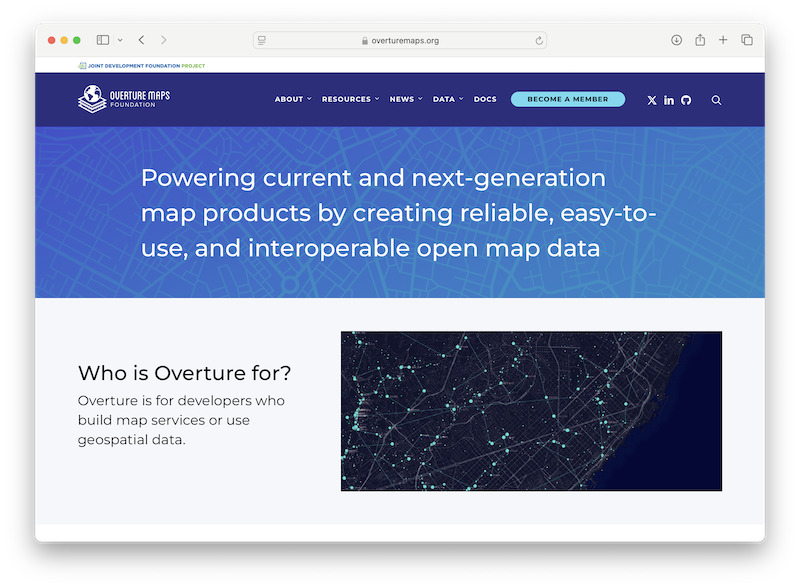
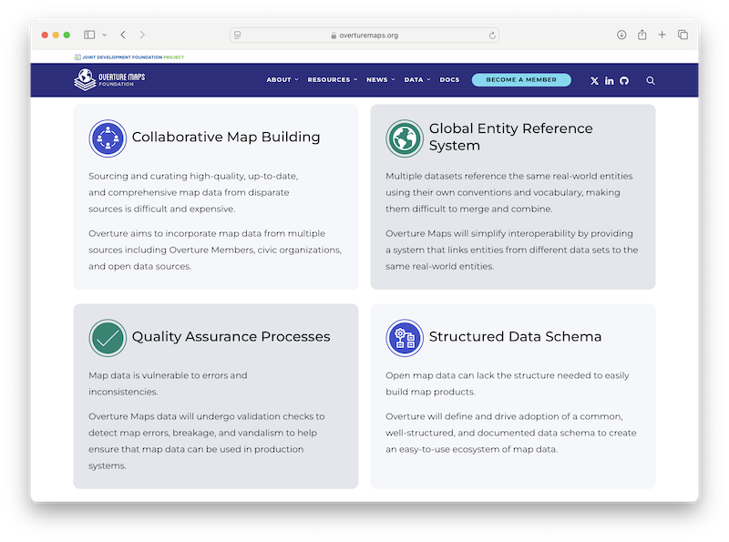
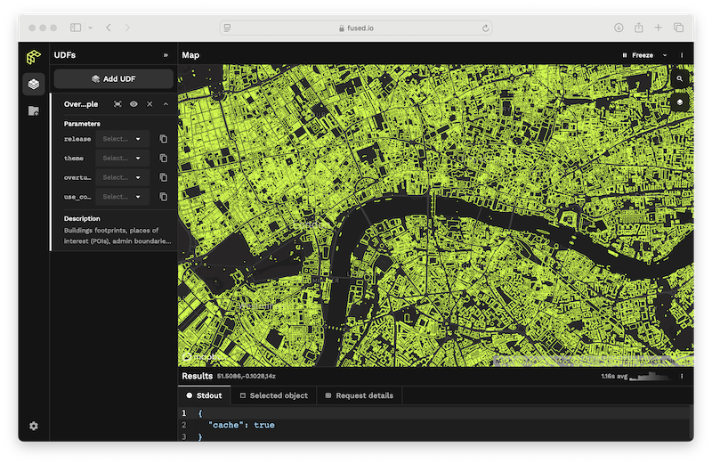
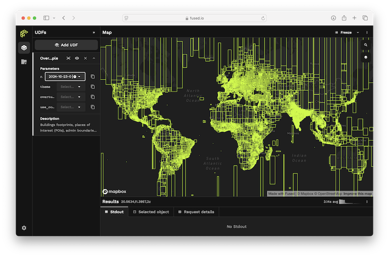
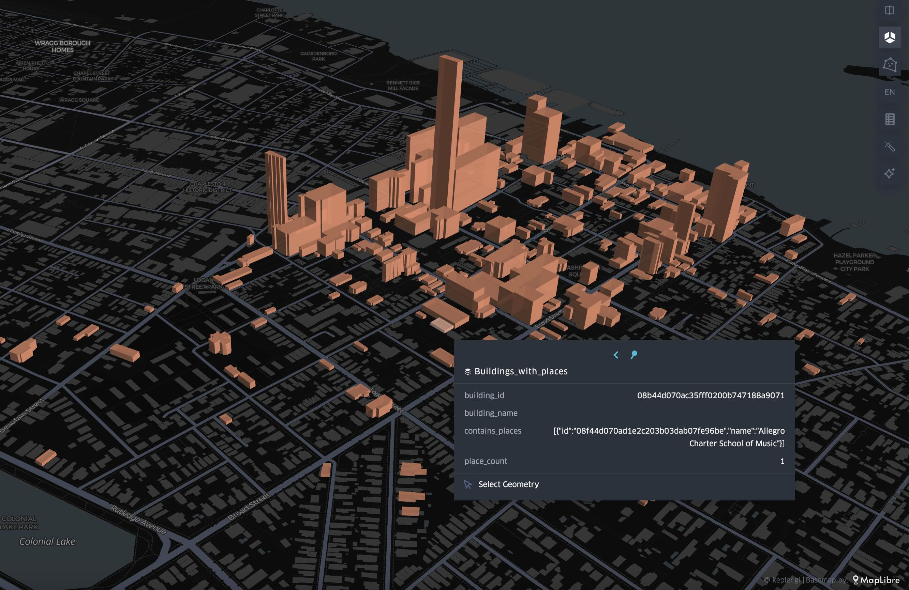
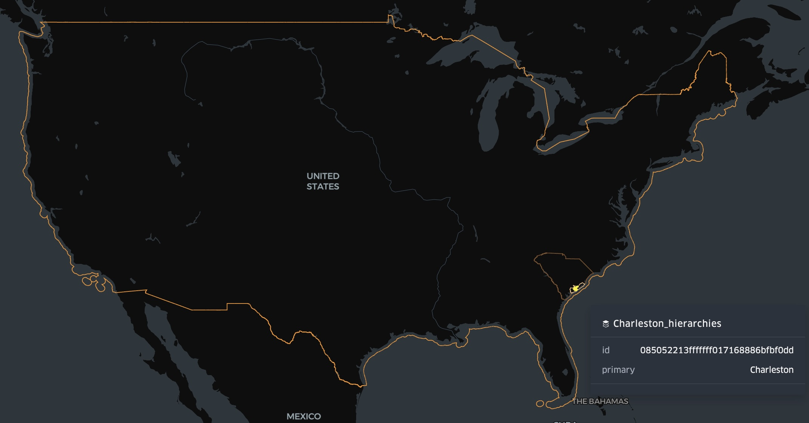
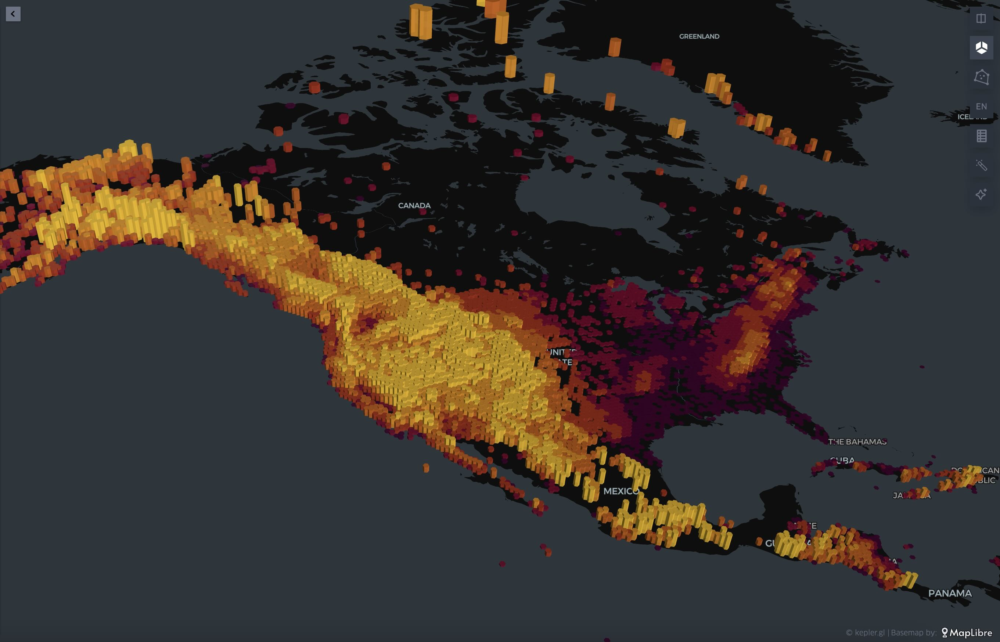

# Overture Data Workshop

## Resources

| Name | Description |
| ---- | ----------- |
| [Overture Explore Page](//explore.overturemaps.org) | Easiest place to get an overview of Overture data in an X-Ray map view  |
| [Overture Documentation](//docs.overturemaps.org/) | Schema definition and examples of how to access and work with Overture data  |
| [DuckDB](https://duckdb.org/) | A fast in-process database system for analytics and data manipulation |
| [Fused.io](//fused.io) | A cloud-based analytics platform with User Defined Functions and embedded map visualization tools. |

## Contents

- [Overture Data Workshop](#overture-data-workshop)
  - [Resources](#resources)
  - [Contents](#contents)
  - [1. What is Overture Maps?](#1-what-is-overture-maps)
  - [2. Accessing Overture Maps Data](#2-accessing-overture-maps-data)
    - [1. The Overture Maps Explore Page](#1-the-overture-maps-explore-page)
    - [2. The Official OvertureMaps-Py tool](#2-the-official-overturemaps-py-tool)
    - [3. Where is Overture Data Hosted?](#3-where-is-overture-data-hosted)
    - [4. Visualizing Overture Data with Fused.io](#4-visualizing-overture-data-with-fusedio)
  - [3. GeoParquet + DuckDB](#3-geoparquet--duckdb)
    - [1. Querying the Places Theme](#1-querying-the-places-theme)
    - [2. Addresses and Transportation Example](#2-addresses-and-transportation-example)
  - [4. The Global Entity Reference System (GERS)](#4-the-global-entity-reference-system-gers)
    - [1. Joining places data to buildings](#1-joining-places-data-to-buildings)
    - [2. Exploring Overture's Divisions \& Hierarchies with GERS](#2-exploring-overtures-divisions--hierarchies-with-gers)
  - [5. Base Theme](#5-base-theme)
    - [1. Mountain Peaks](#1-mountain-peaks)

---

## 1. What is Overture Maps?

| << | [Table of Contents](#contents) | [Resources](#resources) | [Next >>](#2-accessing-overture-maps-data) |



The [Overture Maps Foundation](//overturemaps.org) is an open data project within the Linux Foundation that aims to "Power current and next-generation map products by creating reliable, easy-to-use, and interoperable open map data."

Primarily, "Overture is for developers who build map services or use geospatial data." Additionally, Overture is a fantastic resource for researchers looking to work with one of the most complete and computationally efficient open geospatial datasets.



## 2. Accessing Overture Maps Data

| [<< Previous](#1-what-is-overture-maps) | [Table of Contents](#contents) | [Resources](#resources) | [Next >>](#3-geoparquet--duckdb) |

### 1. The Overture Maps Explore Page

Dive directly into Overture data with the Overture Maps Explore Tool.

1. Visit [explore.overturemaps.org](//explore.overturemaps.org) to see an "x-ray" view of all Overture data presented in an interactive map.

    Overture offers **6** data themes:
    - Addresses
    - Base ( Land-use, Infrastructure, Water )
    - Buildings
    - Divisions ( Administrative boundaries / populated places )
    - Places
    - Transportation

   The explore page lets you inspect the properties of each feature and links out to the overture schema: [docs.overturemaps.org/schema](//docs.overturemaps.org/schema) where you can learn more about the attributes available for each theme.

2. The **Download Visible** button will download features in the viewport as one GeoJSON file per theme-type.

    > [!WARNING] Ensure that only the themes you want to download are selected in the themes panel.

The explore page helps us get an overview of what's in Overture by rendering pre-processed PMTiles archives on a web map. Next, we'll look at the different ways we can interact with Overture data in the  Geoparquet format.

### 2. The Official OvertureMaps-Py tool

[OvertureMaps-Py](//github.com/overturemaps/overturemaps-py) is the official command-line tool supported by the Overture Maps Foundation.

1. The easiest way to install the tool is via PyPi using Pip:

    ```bash
    pip install overturemaps
    ```

2. Once installed, you can simply run the tool with any bounding box:

    ```bash
    overturemaps download --type=place \
        --bbox=-79.9390,32.7725,-79.9212,32.7813 \
        -f geojson \
        -o overture_charleston_places.geojson
    ```

    This tool can produce both GeoJSON and parquet output for any Overture theme and type:

    ```bash
    Usage: overturemaps download [OPTIONS]

    Options:
    --bbox BBOX

    -f [geojson|geojsonseq|geoparquet]
                                    [required]
    -o, --output PATH

    -t, --type [address|building|building_part|
                division|division_area| division_boundary|
                place|segment|connector|infrastructure|
                land|land_cover|land_use|water]

                                    [required]

    --help                          Show this message and exit.

    ```

3. For easy visualization, you can drag-n-drop the resulting GeoJSON file into [kepler.gl](//kepler.gl) to see the data on the map.

### 3. Where is Overture Data Hosted?

Officially, Overture Maps Data is published in geoparquet format on both AWS and Azure. See more on the [Getting Overture Data](https://docs.overturemaps.org/getting-data/) section of our documentation.

Overture data is also repartitioned and republished by a number of other companies and organizations, such as Wherobots, Carto, Esri, and Fused.io.

For example, Wherobots makes Overture data available in their spatial data catalog so that can be easily accessed from the Wherobots cloud with Apache Sedona.

The latest data catalog entry is `wherobots_open_data.overture_2025_03_19_1`.

You can access all of Overture's buildings in Sedona with the following query on Wherobot cloud:

```python
buildings = sedona.sql("SELECT * FROM wherobots_open_data.overture_2025_03_19_1.buildings_building")
```

Talk to any of the Wherobots folks in the room for more demos using Overture.

### 4. Visualizing Overture Data with Fused.io

Fused is a analytical platform with powerful capabilities to read and visualize geoparquet right in your browser. The Fused workbench allows you to run any number of public _[User Defined Functions](https://docs.fused.io/core-concepts/write/) (UDFs)_.

Fused ingests and repartitions Overture data while adding specific metadata for their platform. The resulting files are hosted on source.coop:

```bash
https://data.source.coop/fused/overture/2025-03-19-1/
```



1. In a new browser window, navigate to the Fused [Overture Maps Example UDF](https://www.fused.io/workbench/catalog/Overture_Maps_Example-64071fb8-2c96-4015-adb9-596c3bac6787).
2. Click "Add to UDF Builder" in the upper right.
3. In the left-hand panel, you can adjust the **Parameters** to view different Overture data types.
4. Hover over features on the map to see the complete, raw, Overture data. Fused is actually fetching the complete Overture feature and adding it to the map in your browser, not a pre-computed or tiled version of it.
5. If you zoom all the way out, you can see the spatial partitioning of the data. This is a helpful analytical view in itself, showing Overture data density.

    

    _This particular view of Overture data has been re-partitioned by Fused and is hosted on [source.coop](//source.coop)_

6. A few things to investigate
    - How does the density of the data compare between addresses and buildings?
    - Zoom in on some places and buildings to see all of their metadata.

> [!IMPORTANT] Now that we've seen what's in the data, let's talk about GeoParquet.

## 3. GeoParquet + DuckDB

| [<< Previous](#2-accessing-overture-maps-data) | [Table of Contents](#contents) | [Resources](#resources) | [Next >>](#4-the-global-entity-reference-system-gers) |

As a cloud-native geospatial format, GeoParquet allows us to access discrete chunks of the data without having to first read or download _all_ of Overture.

We'll use DuckDB for the next part.

You can either [install the latest version of DuckDB](https://duckdb.org/docs/installation/?version=stable&environment=cli&platform=macos&download_method=package_manager) on your machine, or use [MotherDuck](//motherduck.com) to run queries directly in the browser. Note that

### 1. Querying the Places Theme

_Tip: When launching DuckDB, specify a persistent DB, like this: `duckdb my_db.duckdb`. Now you can create tables and access them later._

1. Obtain a bounding box of interest (<https://boundingbox.klokantech.com>) is a great tool for creating a bounding box. Specifically, it lets you copy the coordinates in the following format (DublinCore) which is very human-readable.
Here's a bounding box around us today:

    ```python
    westlimit=-79.941;
    southlimit=32.773;
    eastlimit=-79.924;
    northlimit=32.781;
    ```

1. Be sure to run `INSTALL spatial;` and `LOAD spatial;` before running the query. DuckDB does not automatically load the spatial extension.
.
1. A basic places query looks like this:

    ```sql
    SELECT
        id,
        names.primary as name,
        confidence,
        geometry
    FROM read_parquet('s3://overturemaps-us-west-2/release/2025-03-19.1/theme=places/type=place/*')
    WHERE
        bbox.xmin BETWEEN -79.941 AND -79.924
        AND bbox.ymin BETWEEN 32.773 AND 32.781
    LIMIT 10;
    ```

1. When you run that in DuckDB, you should get back something similar to this:

    ```sql
    ┌──────────────────────────────────┬────────────────────────────────────┬────────────────────┬────────────────────────────────┐
    │                id                │                name                │     confidence     │            geometry            │
    │             varchar              │              varchar               │       double       │            geometry            │
    ├──────────────────────────────────┼────────────────────────────────────┼────────────────────┼────────────────────────────────┤
    │ 08f44d070e68d30003b32089f445080d │ Limehouse Street                   │ 0.8941256830601093 │ POINT (-79.9372113 32.7734121) │
    │ 08f44d070e6d019803900b540a2a4236 │ Berkeley Baptist Church            │ 0.3184402924451666 │ POINT (-79.936934 32.774703)   │
    │ 08f44d070a98216d03b3c8e193348df2 │ Belvedere Charleston               │ 0.9793990828827596 │ POINT (-79.9402982 32.7772198) │
    │ 08f44d070e6d8c7003981419755cd4bb │ Burbages Grocery                   │ 0.9793990828827596 │ POINT (-79.9373814 32.7757701) │
    │ 08f44d070ad639090352e4ad39523c21 │ Charleston 1857                    │ 0.8941256830601093 │ POINT (-79.9380699 32.7771415) │
    │ 08f44d070ad4294103fee6d3c0e9b095 │ Clemson Architecture Center        │ 0.7579666160849773 │ POINT (-79.937327 32.777646)   │
    │ 08f44d070ad40c4003a6d288954d52c6 │ Housing Authority                  │ 0.2803234501347709 │ POINT (-79.937309 32.777705)   │
    │ 08f44d070a98364203a7f195a05a05fb │ CoLife                             │ 0.5185185185185185 │ POINT (-79.94036 32.77778)     │
    │ 08f44d070a8a1b2503877d7227d53709 │ Ammons Dental By Design            │               0.77 │ POINT (-79.94092 32.77945)     │
    │ 08f44d070a8a1b2503e6eeb3bc1ab13e │ Wentworth Street Dental Associates │               0.77 │ POINT (-79.94092 32.77945)     │
    ├──────────────────────────────────┴────────────────────────────────────┴────────────────────┴────────────────────────────────┤
    │ 10 rows                                                                                                           4 columns │
    └─────────────────────────────────────────────────────────────────────────────────────────────────────────────────────────────┘
    ```

    > [!NOTE] Results might look slightly different in the MotherDuck UI. Try ST_ASTEXT(geometry) to see the Point.

    Notice the type of the geometry column is `geometry`. This is DuckDB recognizing the geoparquet metadata and handling the column type properly.

1. Consult the [places schema](https://docs.overturemaps.org/schema/reference/places/place/) to learn more about which columns can be accessed and their data types.

1. Notice the `confidence` column. This is a score between 0 and 1 that indicates how likely it is that a place exists. Rather than download all of the data and run statistics, we can let DuckDB do all of the heavy lifting:

    ```sql
    SELECT
        round(confidence, 1) AS confidence,
        count(1)
    FROM read_parquet('s3://overturemaps-us-west-2/release/2025-03-19.1/theme=places/type=place/*')
    WHERE
        bbox.xmin BETWEEN -79.941 AND -79.924
        AND bbox.ymin BETWEEN 32.773 AND 32.781
        GROUP BY 1
        ORDER BY confidence DESC
   ```

1. Going one step further, we can explore the distribution of places with H3 cells, calculated from the bounding box column. The following query uses the `h3_latlng_to_cell_string` function to convert the bounding box to H3 cells, and then counts the number of places in each cell. It writes the results to a CSV file.

    ```sql
    INSTALL h3 from community;
    LOAD h3;

    COPY(
        SELECT
            h3_latlng_to_cell_string(bbox.ymin, bbox.xmin, 11) as h3,
            count(1) AS places
        FROM read_parquet('s3://overturemaps-us-west-2/release/2025-03-19.1/theme=places/type=place/*')
        WHERE
            bbox.xmin BETWEEN -79.941 AND -79.924
            AND bbox.ymin BETWEEN 32.773 AND 32.781
            AND confidence > 0.7
        GROUP BY 1
    ) TO 'charleston_places_h3.csv';
    ```

    > [!NOTE] This probably will not work in MotherDuck

1. Now drag the resulting CSV file into [kepler.gl](//kepler.gl) to see the results.

1. While that is interesting, let's just scale it up a bit:

    ```sql
    COPY(
        SELECT
            h3_latlng_to_cell_string(bbox.ymin, bbox.xmin, 8) as h3,
            count(1) AS places
        FROM read_parquet('s3://overturemaps-us-west-2/release/2025-03-19.1/theme=places/type=place/*')
        WHERE
            bbox.xmin BETWEEN -83.354 AND -78.541
            AND bbox.ymin BETWEEN 32.0335 AND 35.2155
            AND confidence > 0.7
        GROUP BY 1
    ) TO 'south_carolina_place_density.csv';
    ```

1. Going further, just remove all of the bounding box constraints. This will give us a global view of places in Overture. We probably shouldn't all run this at the same time, but you get the idea.

    ```sql
    COPY(
        SELECT
            h3_latlng_to_cell_string(bbox.ymin, bbox.xmin, 5) as h3,
            count(1) AS places
        FROM read_parquet('s3://overturemaps-us-west-2/release/2025-03-19.1/theme=places/type=place/*')
        WHERE
            confidence > 0.7
        GROUP BY 1
    ) TO 'global_place_density.csv';
    ```

### 2. Addresses and Transportation Example

1. Overture Addresses

    > [!WARNING] This is a much larger theme, so the query requires significantly more bandwidth. The results should be the same as what's visualized on the documentation page: <https://docs.overturemaps.org/guides/addresses/>

    ```sql
    COPY(
        SELECT
            h3_latlng_to_cell_string(bbox.ymin, bbox.xmin, 5) as h3,
            count(1) AS addresses
        FROM read_parquet('s3://overturemaps-us-west-2/release/2025-03-19.1/theme=addresses/type=address/*')
        GROUP BY 1
    ) TO 'global_overture_address_density.csv';
    ```

1. Or we can use _connectors_ as a proxy for road complexity in the transportation theme:

    ```sql
    COPY(
        SELECT
            h3_latlng_to_cell_string(bbox.ymin, bbox.xmin, 8) as h3,
            count(1) AS road_complexity
        FROM read_parquet('s3://overturemaps-us-west-2/release/2025-03-19.1/theme=transportation/type=connector/*')
        WHERE
            bbox.xmin BETWEEN -83.354 AND -78.541
            AND bbox.ymin BETWEEN 32.0335 AND 35.2155
        GROUP BY 1
    ) TO 'south_carolina_transportation_connector_density.csv';
    ```

The takeaway here is that we can get a pretty good idea of what Overture data looks like without having to download it all first.

## 4. The Global Entity Reference System (GERS)

| [<< Previous](#3-geoparquet--duckdb) | [Table of Contents](#contents) | [Resources](#resources) | >> |

An Overture ID is a 128-bit unique identifier that, if part of the Global Entity Reference System, will exist in the GERS Registry (coming soon).

Overture is committed to keeping GERS IDs stable across releases and data updates.

Associating third-party data with GERS can be as simple as a spatial join between the two datasets.

### 1. Joining places data to buildings

1. Using nearly the same query as before, we can use DuckDB to perform a spatial join between Overture buildings and places to get a list of places and their IDs that are contained by the building.

    ```sql
    COPY(
        SELECT
            buildings.id AS building_id,
            buildings.names.primary as building_name,
            buildings.geometry AS geometry,
            JSON(ARRAY_AGG(
                CAST(
                    ROW(places.id, places.names.primary) AS
                    ROW(id varchar, name varchar)
                )
            )) AS contains_places,
            COUNT(places.id) AS place_count
        FROM read_parquet('s3://overturemaps-us-west-2/release/2025-03-19.1/theme=places/type=place/*') places JOIN read_parquet('s3://overturemaps-us-west-2/release/2025-03-19.1/theme=buildings/type=building/*') buildings
        ON ST_Intersects_Extent(
            buildings.geometry,
            places.geometry
        )
        WHERE
            places.bbox.xmin BETWEEN -79.941 AND -79.924
            AND places.bbox.ymin BETWEEN 32.773 AND 32.781
            AND buildings.bbox.xmin > -79.941
            AND buildings.bbox.xmax < -79.924
            AND buildings.bbox.ymin > 32.773
            AND buildings.bbox.ymax < 32.781
        GROUP BY 1,2,3
    ) TO 'buildings_with_places.geojson' WITH (FORMAT GDAL, DRIVER GeoJSON);
    ```

1. Load the resulting GeoJSON file, `buildings_with_places.geojson` into KeplerGL to see which Overture buildings contain an Overture places record:


### 2. Exploring Overture's Divisions & Hierarchies with GERS

Overture's _Divisions_ theme contains administrative boundaries and points for global administrative areas.

1. In this example, we'll use DuckDB to connect to Azure and read the parquet files from Azure blob storage. These are mirrors of the same files we were previously accessing on Amazon S3.

    ```sql
    INSTALL azure;
    LOAD azure;
    SET azure_storage_connection_string = 'DefaultEndpointsProtocol=https;AccountName=overturemapswestus2;AccountKey=;EndpointSuffix=core.windows.net';

    CREATE TABLE charleston AS (
        SELECT
            *
        FROM
            read_parquet('azure://release/2025-03-19.1/theme=divisions/type=division/*')
        WHERE
            -- ID for Charleston, South Carolina
            id = '085052213fffffff014a308a7966bf2a'
    );
    ```

2. If we query that table, we can see the Divisions hierarchy: Charleston is a locality in Charleston County, which is in the region of South Carolina, within the country of the United States.

    ```sql
    SELECT
        h.name,
        h.subtype,
        h.division_id
    FROM
        charleston
    CROSS JOIN UNNEST(hierarchies[1]) AS t(h);
    ```

3. If we wanted to retrieve the actual polygons for these divisions, we can search the `division_area` type of the divisions theme:

    ```sql
    COPY(
        SELECT
            names.primary AS name,
            subtype,
            id,
            geometry
        FROM
            read_parquet('azure://release/2025-03-19.1/theme=divisions/type=division_area/*') areas
        WHERE
            division_id IN (
                SELECT
                    h.division_id
                FROM
                    charleston
                CROSS JOIN UNNEST(hierarchies[1]) AS t(h)
            )
    ) TO 'charleston_hierarchies.geojson' WITH (FORMAT GDAL, DRIVER GeoJSON);
    ```

4. Load `charleston_hierarchies.geojson` into KeplerGL and you can see the complete hierarchy:
    

## 5. Base Theme

_Base_ contains other geospatial data that someone building a map service needs for a complete map. Currently, this includes:

1. Bathymetry & LandCover
2. Land & Water (Oceans, Lakes, Rivers, Mountains, etc.)
3. Landuse (Parks, Residential, Commercial, Schools, Airports, etc.)
4. Infrastructure (Power lines, barriers, stoplights, etc.)

This data is sourced primarily from OpenStreetMap and Overture performs basic classification of the features based on their OSM tags. This data undergoes many QA checks in this process.

### 1. Mountain Peaks

1. The following query extracts all of the peaks with names and elevations from OpenStreetMap.

    ```sql
    CREATE TABLE na_peaks AS (
        SELECT
            names.primary as name,
            elevation,
            geometry,
            bbox
        FROM read_parquet('s3://overturemaps-us-west-2/release/2025-03-19.1/theme=base/type=land/*.parquet')
        WHERE
            subtype = 'physical'
            AND class IN ('peak','volcano')
            AND names.primary IS NOT NULL
            AND elevation IS NOT NULL
            AND bbox.xmin BETWEEN -175 AND -48
            AND bbox.ymin BETWEEN 10 AND 85
    );
    ```

2. We can build an h3-gridded DEM for the World from this table:

    ```sql
    COPY(
        SELECT
            h3_latlng_to_cell_string(bbox.ymin, bbox.xmin, 7) as h3,
            max(elevation) as _max,
            min(elevation) as _min,
            avg(elevation) as _avg
        FROM na_peaks
        GROUP BY 1
    ) TO 'na_dem_h3_hi.csv';
    ```

    
