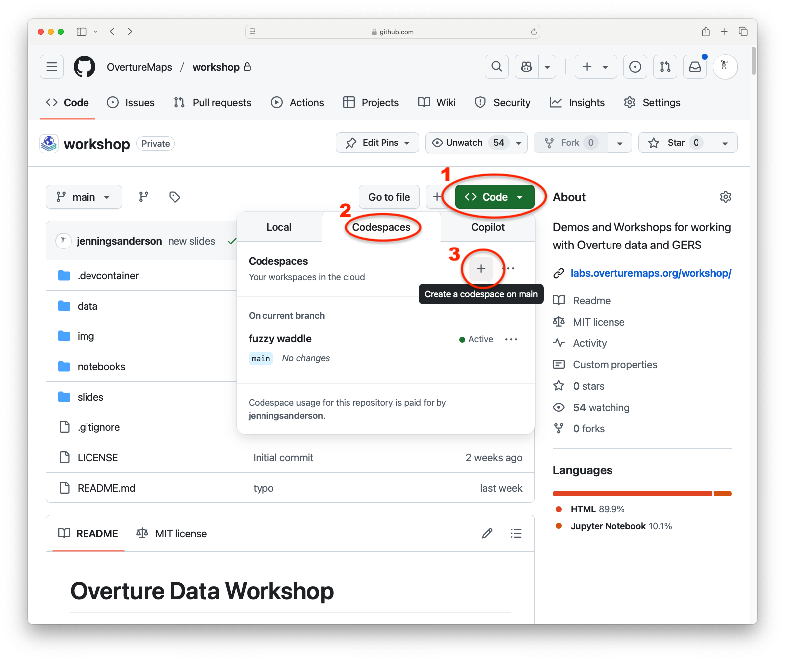
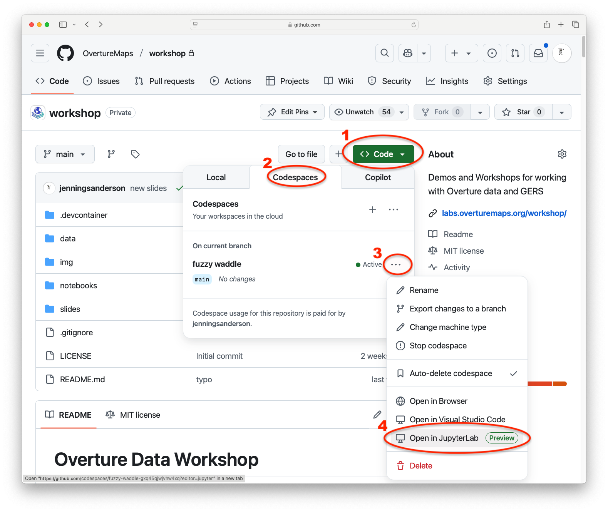

# Overture Maps Workshop

## Resources

| Name | Description |
| ---- | ----------- |
| [Overture Explore Page](//explore.overturemaps.org) | Easiest place to get an overview of Overture data in an X-Ray map view  |
| [Overture Documentation](//docs.overturemaps.org/) | Schema definition and examples of how to access and work with Overture data  |
| [DuckDB](https://duckdb.org/) | A fast in-process database system for analytics and data manipulation |
| [Fused.io](//fused.io) | A cloud-based analytics platform with User Defined Functions and embedded map visualization. |

---

## Workshop Lessons

[View as Slideshow](slides/)

### 1. [What is Overture Maps?](1-what-is-overture.md)

### 2. [Exploring Overture Maps Data](2-accessing-data.md)

### 3. [Accessing Overture Maps GeoParquet with DuckDB](3-geoparquet-duckdb.md)

### 4. [Global Entity Reference System (GERS)](4-gers.md)

### 5. [Base Theme](5-base-theme.md)

---

## Workshop Setup

This workshop can be run either locally with DuckDB and a local Jupyter Notebook environment or in the cloud with Github codespaces (instructions below).

_DuckDB Tip!_ When launching DuckDB, be sure to specify a database, such as `duckdb workshop.dbb`. You can now save tables and views that will persist in a future session.

_Experimental_: Attach the following database in DuckDB to access the latest Overture data:

```sql
LOAD spatial;
ATTACH 'https://labs.overturemaps.org/data/latest.dbb' as overture;

-- Now you can just reference `overture.place` for type=place features
SELECT count(1) from overture.place;
```

### Github Codespaces

Create a new codespace from the [workshop repository](https://github.com/OvertureMaps/workshop) in 3 clicks:



### Launch JupyterLab

Once your codespace is active, you can open it in JupyterLab to easily run interactive notebooks

