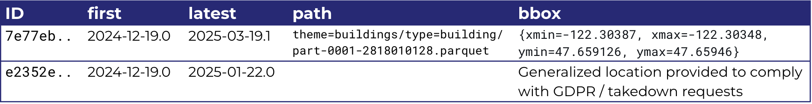
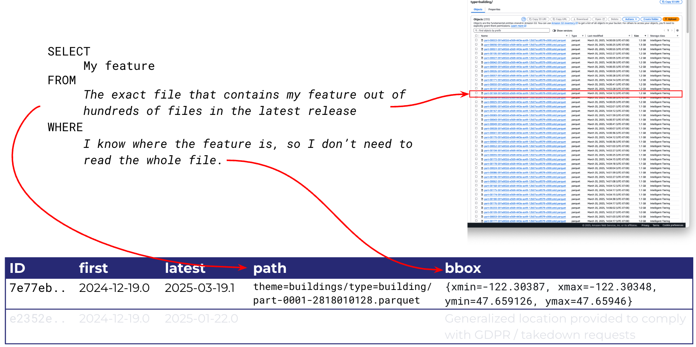
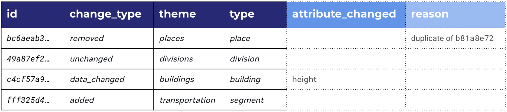

# Global Entity Reference System (GERS)

### Overture Maps Foundation

>>>

Doctrine?

>>>

## Components of the Global Entity Reference _System_

1. **Latest Overture Release**

<<<

### Latest Overture Release
<!-- .slide: data-background-image="../img/cliff-lodge.png" data-background-opacity="0.6"-->

To be a part of GERS... <!-- .element: class="fragment" style="float:left;" -->

...The feature must exist in Overture <!-- .element: class="fragment" style="clear:left; float:right;" -->

   

We cannot assign an ID and commit to keeping it stable if we don't know what or where the entity is <!-- .element: class="fragment" style="clear:right; font-style:italic;" -->

>>>

## Components of the Global Entity Reference _System_

1. Latest Overture Release
2. **Registry of all IDs**

<<<

### GERS Registry

How do I know if a UUID is a GERS ID?

- Look it up in the GERS Registry: **Official Record** of every ID ever released
  - Is the ID present in the latest release?
  - What was the last release that contained this ID?

- Enables GERS ID based search: Where the feature can be found both geographically and in the file.

<<<

### GERS Registry

ID based search: Where the feature can be found both geographically and in the file.

<!--  -->

>>>

## Global Entity Reference _System_

1. Latest Overture Release
2. Registry of all IDs
3. **Data Changelog**

<<<

### Data Changelog

ID-based

>>>

## Global Entity Reference _System_

1. Latest Overture Release
2. Registry of all IDs
3. Data Changelog
4. Bridge Files

<<<

### Bridge Files

Some bridge file examples

>>>

## Global Entity Reference _System_

1. Latest Overture Release
2. Registry of all IDs
3. Data Changelog
4. Bridge Files
5. **Onboarding Services**

<<<

### GERS Onboarding Services

Third party services that offer a gers id lookup service

>>>
