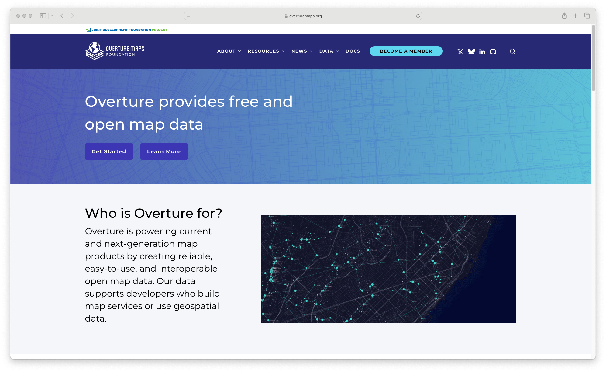
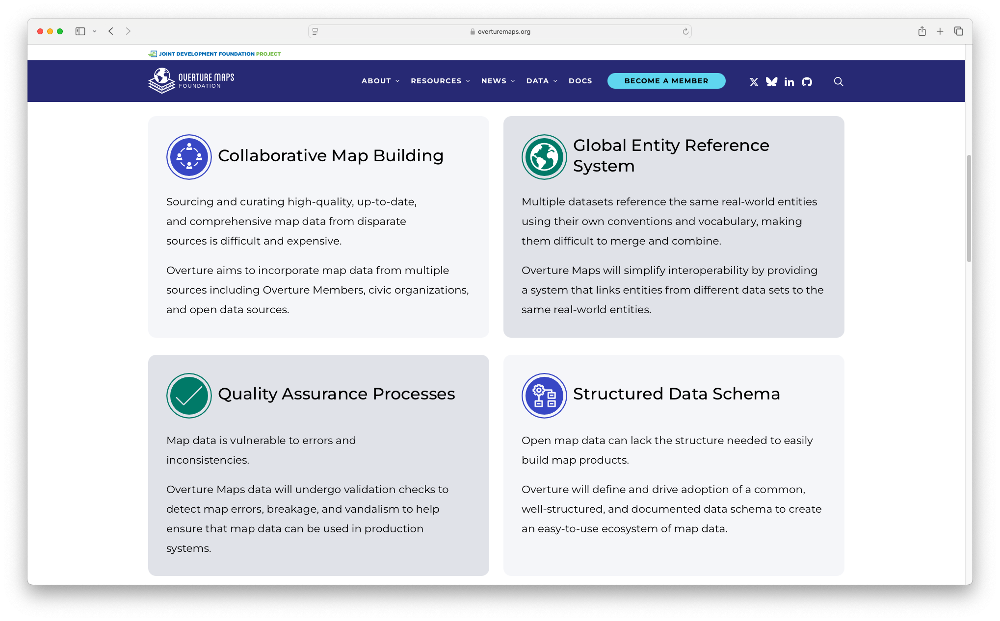

# Overture Maps Data Workshop

[github.com/overturemaps/workshop](//github.com/overturemaps/workshop)

[labs.overturemaps.org/workshop/](//labs.overturemaps.org/workshop/)

<<<

## What is Overture Maps?

<<<

## Why Overture?

>>>

## The GeoSpatial Data Challenge

Notes:
What’s the problem?
Proliferation of sensors combined with connectivity, More geospatial data available than ever
This comes with higher costs & complexity to integrate
“Data conflation tax”: Costly (re)matching to integrate new data
“Spending more on integrating data than on licensing it”. Smaller players are disproportionately burdened
When innovation suffers, users suffer

<<<

### Data onboarding is a _tax_ on the data ecosystem

- **Tax on Budgets**: Data onboarding costs more than licensing.
- **Tax on Market Size**: Data onboarding and geospatial conflation is too hard, limiting the addressable market.
- **Tax on Intelligence**: Data science and analysis suffer because hypotheses requiring new datasets cannot be quickly tested.

_When data is easier to acquire and use, it increases its value and the value of data with which it can connect._
